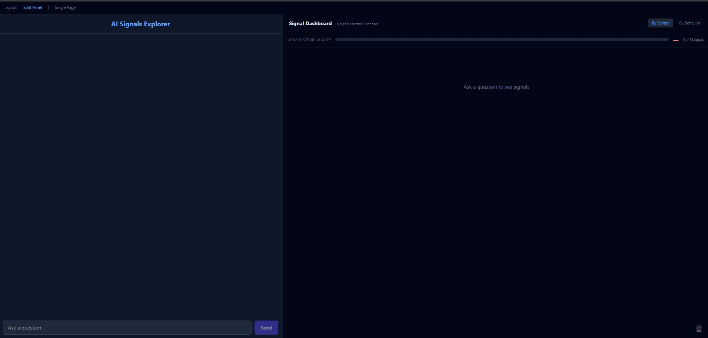
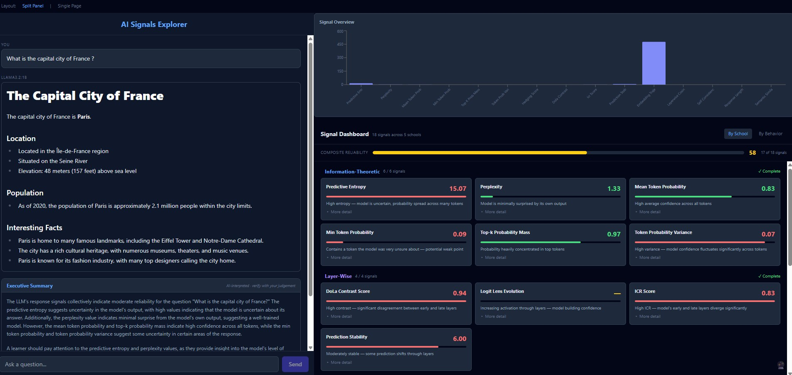
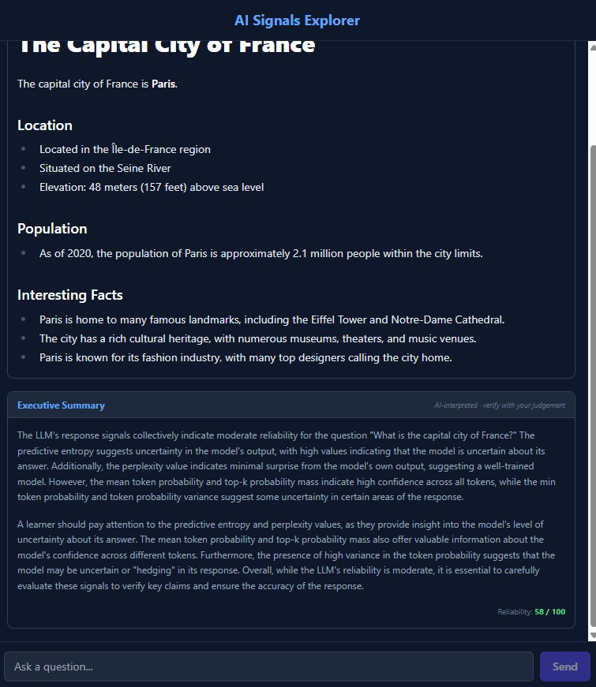
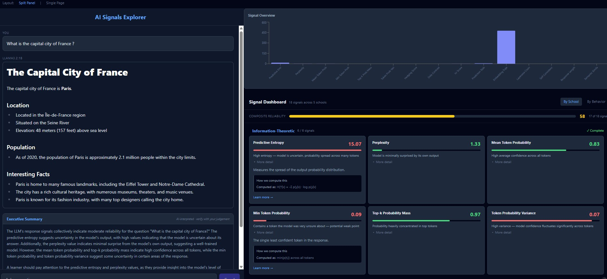
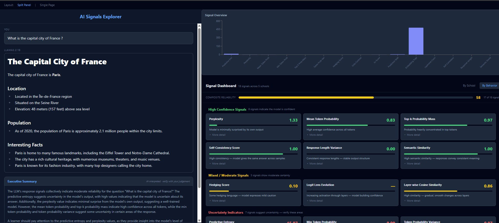
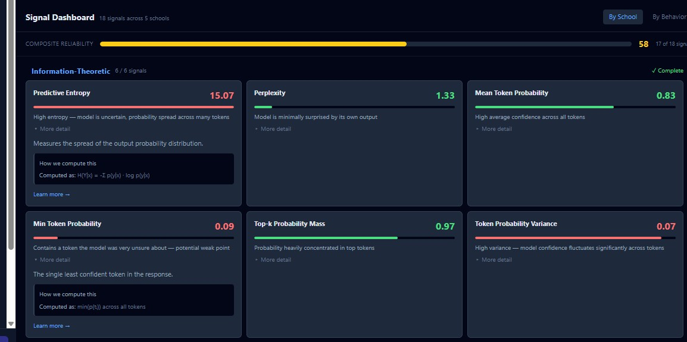
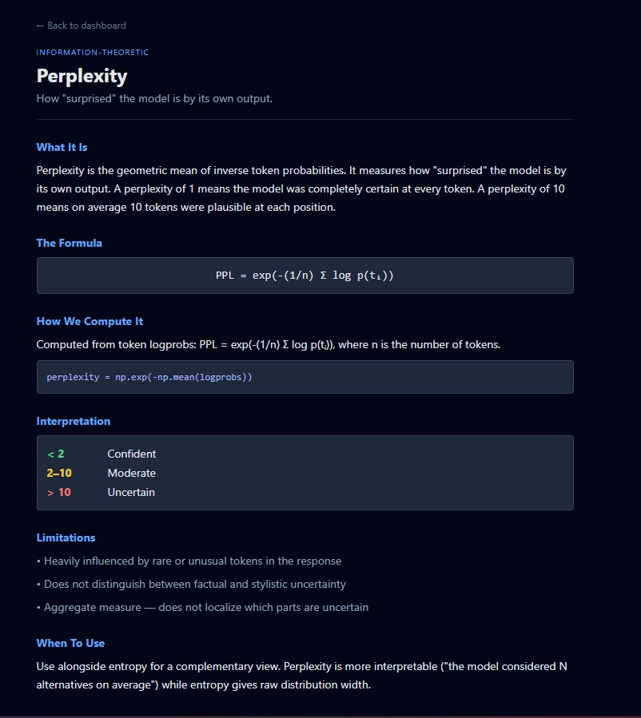

```
     ___    ____   _____    _                    __        ______            __                     
    /   |  /  _/  / ___/   (_)___ _____  ____ _ / /____   / ____/  ___  __ / /  ____   _____ ___   _____
   / /| |  / /    \__ \   / // _ `/ __ \/ __ `// // ___/ / __/    \ \/ // __ \ / __ \ / ___// _ \ / ___/
  / ___ |_/ /    ___/ /  / // /_/ / / / / /_/ // /(__  ) / /___    >  </ /_/ // /_/ // /   /  __// /    
 /_/  |_/___/   /____/  /_/ \__, /_/ /_/\__,_//_//____/ /_____/   /_/\_\____/ \____//_/    \___//_/     
                            /____/                                                                      

              ╔══════════════════════════════════════════════════════╗
              ║       AI models are not black boxes.                ║
              ║       Their internal states are readable.           ║
              ║       This tool makes that visible.                 ║
              ╚══════════════════════════════════════════════════════╝
```

# AI Signals Explorer

**A real-time LLM observability tool that visualizes 18 internal model signals across 5 schools of thought.**

Ask a question to a local LLM, and watch as the app extracts, visualizes, groups, and interprets the model's internal confidence, uncertainty, and reasoning signals — progressively, in real-time.

Built for AI learners, researchers, and anyone who wants to look under the hood of language models.

---

## What This Is

When an LLM generates a response, it computes a rich stream of internal states: probability distributions, layer activations, geometric trajectories through representation space. These signals encode uncertainty, knowledge boundaries, and reasoning quality — but they're invisible to the end user.

**AI Signals Explorer makes them visible.**

You ask a question. The model responds. Then the app extracts 18 signals from the model's internals and displays them with interactive charts, contextual interpretations, and an AI-generated executive summary — all arriving progressively as they're computed.

## Screenshots

### Empty State
*The clean starting point — ask a question to begin signal analysis.*



### Question, Answer & Signals
*Ask a question and watch signals populate progressively in the right panel.*



### Executive Summary
*An AI-generated synthesis of all signals with inline references.*



### Grouping by Schools
*Signals organized by their school of thought — Information-Theoretic, Layer-Wise, etc.*



### Grouping by Behavior
*Toggle to see signals classified by what they're saying: confident, mixed, or uncertain.*



### Signal Card — Expanded Detail
*Expand any signal to see how it's computed, its formula, and caveats.*



### Signal Detail Page
*Full deep-dive page with formula, code, interpretation, limitations, and research references.*



---

## The 5 Schools of Signals

Research has identified **147+ distinct signals** organized into **7 schools of thought** for reading LLM internal states. This tool implements 18 production-viable signals across 5 of those schools:

| School | Signals | What It Measures | Source |
|--------|---------|-----------------|--------|
| **Information-Theoretic** | 6 | Uncertainty in probability distributions | Ollama logprobs |
| **Layer-Wise** | 4 | Knowledge encoded across transformer layers | HuggingFace hidden states |
| **Geometric / Manifold** | 2 | Trajectories through representation space | HuggingFace hidden states |
| **Behavioral / Consistency** | 4 | Agreement across multiple samples | Ollama multi-sampling |
| **Calibration / Statistical** | 2 | Confidence-accuracy alignment | Derived from above |

### Signal Catalog

<details>
<summary><strong>Information-Theoretic (6 signals)</strong> — instant, via logprobs</summary>

| Signal | What It Tells You |
|--------|-------------------|
| **Predictive Entropy** | How spread out the model's probability distribution is |
| **Perplexity** | How "surprised" the model is by its own output |
| **Mean Token Probability** | Average confidence per generated token |
| **Min Token Probability** | The single least confident token — the weakest link |
| **Top-k Probability Mass** | How concentrated probability is in the top choices |
| **Token Probability Variance** | Whether confidence is consistent or fluctuating |

</details>

<details>
<summary><strong>Layer-Wise (4 signals)</strong> — 3-5 seconds, via hidden states</summary>

| Signal | What It Tells You |
|--------|-------------------|
| **DoLa Contrast Score** | Whether early and late layers agree on the answer |
| **Logit Lens Evolution** | How the model's prediction forms across layers |
| **ICR Score** | Whether the model "changed its mind" between layers |
| **Prediction Stability** | How often the top prediction flips across layers |

</details>

<details>
<summary><strong>Geometric (2 signals)</strong> — 3-5 seconds, via hidden states</summary>

| Signal | What It Tells You |
|--------|-------------------|
| **Embedding Trajectory Length** | How much computational work the model did |
| **Layer-wise Cosine Similarity** | How much each layer transforms the representation |

</details>

<details>
<summary><strong>Behavioral (4 signals)</strong> — 5-8 seconds, via multi-sampling</summary>

| Signal | What It Tells You |
|--------|-------------------|
| **Self-Consistency Score** | Whether the model gives the same answer across samples |
| **Response Length Variance** | Whether response structure is stable |
| **Hedging Score** | Linguistic markers of uncertainty ("I think", "perhaps") |
| **Semantic Similarity** | Whether responses convey consistent meaning |

</details>

<details>
<summary><strong>Calibration (2 signals)</strong> — derived from above</summary>

| Signal | What It Tells You |
|--------|-------------------|
| **Confidence-Uncertainty Agreement** | Whether stated confidence matches actual signals |
| **Composite Reliability Score** | Single 0-100 "bottom line" reliability metric |

</details>

---

## Key Features

- **Progressive Signal Delivery** — Fast signals (entropy, perplexity) arrive instantly. Expensive signals (self-consistency) arrive in seconds. You see them populate in real-time, naturally demonstrating the efficiency-accuracy tradeoff.

- **Two Layout Modes** — Split-panel (default) shows chat and signals side by side. Single-page mode stacks everything vertically. Toggle in settings.

- **Two Grouping Modes** — Group signals by their school of thought (default), or toggle to behavioral grouping which classifies signals by what they're actually saying: High Confidence / Mixed / Uncertainty.

- **Signal Detail Pages** — Click "Learn more" on any signal to open a dedicated page with the formula, code, interpretation thresholds, limitations, and research paper references.

- **Executive Summary** — An AI-generated paragraph that synthesizes all signals into a readable interpretation with inline signal references.

- **Transparency Built In** — Every signal card shows "How we compute this" and its research basis. The app presents itself as a lens, not an oracle. Signals are proxies, not ground truth — and the app is honest about that.

- **Easter Egg: Oracle Mode** — Find the hidden toggle and discover a mystical theme where the dashboard becomes a "Signal Grimoire" and the summary becomes "The Reading." Same rigorous signals, deadpan mystical chrome.

---

## Quick Start

### Prerequisites

- [Docker Desktop](https://www.docker.com/products/docker-desktop/) (the only requirement)

### Run

```bash
git clone https://github.com/YOUR_USERNAME/ai-signals.git
cd ai-signals
docker compose up
```

Open **http://localhost:3000** in your browser.

### First Launch

On first launch, the app downloads two models. A progress banner shows the download status:

| Model | Size | Purpose | Downloaded To |
|-------|------|---------|---------------|
| `llama3.2:1b` | ~1.3 GB | Chat, logprobs, multi-sampling | Docker volume (persists) |
| `Qwen/Qwen2.5-0.5B` | ~1 GB | Hidden state extraction (24 layers) | Docker volume (persists) |

**First launch: ~5-10 minutes** (depending on internet speed). **Subsequent launches: seconds** — models are cached in Docker volumes.

### Resource Usage

| Resource | Usage |
|----------|-------|
| RAM | ~6-8 GB (Ollama + HuggingFace + containers) |
| Disk | ~4 GB (Docker image + models) |
| GPU | Not used (all CPU inference) |

---

## Architecture

```
┌─────────────────────┐      SSE / REST      ┌─────────────────────┐            ┌─────────────────────┐
│                     │  ◄─────────────────►  │                     │  ◄───────► │                     │
│   Frontend          │                       │   Backend           │            │   Model Layer       │
│   React + TS + Vite │                       │   Python FastAPI    │            │                     │
│   Tailwind + Recharts│                      │                     │            │   Ollama (1B)       │
│                     │                       │   Signal Engine     │            │   HuggingFace (0.5B)│
└─────────────────────┘                       └─────────────────────┘            └─────────────────────┘
     localhost:3000                                localhost:8000                    localhost:11434
```

**Three Docker containers**, one command:

- **Frontend** — React + TypeScript + Vite, built to static files, served by nginx
- **Backend** — Python FastAPI, orchestrates signal computation, streams results via SSE
- **Ollama** — Runs the chat model locally, no external API calls

### Data Flow

1. User submits a question
2. Backend sends it to Ollama, gets response with logprobs
3. Response returns to the frontend immediately
4. Backend starts computing signals progressively via SSE stream:
   - **Phase 1 (instant)**: Information-theoretic signals from logprobs + hedging detection
   - **Phase 2 (3-5s)**: Layer-wise + geometric signals from HuggingFace hidden states
   - **Phase 3 (5-8s)**: Behavioral signals from Ollama multi-sampling (5 responses)
   - **Phase 4**: Composite score + AI-generated executive summary
5. Frontend renders each signal card as it arrives

---

## Configuration

### Switching the Ollama Model

The default model is `llama3.2:1b` (small, fast). You can switch to any Ollama model via the API:

```bash
# Pull a larger model
docker exec ai-signals-ollama ollama pull llama3.2:3b

# Switch the active model
curl -X POST http://localhost:3000/api/models/switch \
  -H "Content-Type: application/json" \
  -d '{"model": "llama3.2:3b"}'
```

### Environment Variables

| Variable | Default | Description |
|----------|---------|-------------|
| `OLLAMA_BASE_URL` | `http://ollama:11434` | Ollama API endpoint |
| `DEFAULT_OLLAMA_MODEL` | `llama3.2:1b` | Default chat model |
| `HF_MODEL_NAME` | `Qwen/Qwen2.5-0.5B` | HuggingFace model for hidden states |
| `HF_HOME` | `/hf_cache` | HuggingFace cache directory |

---

## Project Structure

```
ai-signals/
├── docker-compose.yml              # One command to run everything
├── frontend/
│   ├── src/
│   │   ├── components/             # SignalCard, ChatPanel, Dashboard, etc.
│   │   ├── pages/                  # HomePage, SignalDetailPage
│   │   ├── hooks/                  # useSignalStream (SSE), useTheme
│   │   ├── themes/                 # Research + Oracle theme configs
│   │   ├── data/                   # All 18 signal definitions
│   │   └── types/                  # TypeScript interfaces
│   └── Dockerfile
├── backend/
│   ├── app/
│   │   ├── api/                    # REST + SSE endpoints
│   │   ├── signals/                # One module per school
│   │   │   ├── info_theoretic.py   # 6 signals
│   │   │   ├── layer_wise.py       # 4 signals
│   │   │   ├── geometric.py        # 2 signals
│   │   │   ├── behavioral.py       # 4 signals
│   │   │   └── calibration.py      # 2 signals
│   │   ├── models/                 # Ollama + HuggingFace clients
│   │   └── signals/engine.py       # Orchestrates progressive computation
│   ├── tests/                      # Signal unit tests
│   └── Dockerfile
└── docs/
    └── future-roadmap.md
```

---

## The Philosophy

### Signals are proxies, not oracles

Every signal in this tool is an approximation. Entropy measures distribution spread, not correctness. Self-consistency measures agreement, not accuracy. A confident model can still be wrong.

This tool doesn't hide that. Every signal card shows how it's computed and what its limitations are. The executive summary is labeled as AI-interpreted. The tagline is "a lens, not a prophecy."

The goal is to give you **more information** to make better judgements — not to replace your judgement.

### Why progressive delivery?

Signals have different costs. Entropy is free (computed from existing logprobs). Self-consistency requires 5 separate model calls. Layer-wise signals require running a separate model.

By delivering signals progressively, the tool naturally teaches the **efficiency-accuracy tradeoff** — one of the key patterns from LLM observability research. Fast signals give you a quick read. Expensive signals confirm or challenge that read.

---

## Research References

This tool is grounded in published research on LLM uncertainty and observability:

- Kuhn et al., 2023 — [Semantic Entropy](https://arxiv.org/abs/2302.09664)
- Kossen et al., 2024 — [Semantic Entropy Probes](https://arxiv.org/abs/2406.15927)
- Chuang et al., 2023 — [DoLa: Decoding by Contrasting Layers](https://arxiv.org/abs/2309.03883)
- Wang et al., 2022 — Self-Consistency Improves Chain of Thought Reasoning
- Kadavath et al., 2022 — Language Models (Mostly) Know What They Know
- Wang et al., 2024 — REMA: Reasoning Manifold Deviation
- Nostalgebraist, 2020 — The Logit Lens

---

## Future Roadmap

See [docs/future-roadmap.md](docs/future-roadmap.md) for planned features:

1. Cross-question comparison and trend analysis
2. Contextual signal explanations per question
3. Additional signals (Semantic Entropy, REMA, activation patching)
4. Model comparison (same question, different models)
5. Export signal reports

---

## Tech Stack

| Layer | Technology |
|-------|-----------|
| Frontend | React 18, TypeScript, Vite, Tailwind CSS, Recharts, react-markdown |
| Backend | Python 3.11, FastAPI, SSE (sse-starlette), PyTorch CPU, HuggingFace Transformers |
| Models | Ollama (llama3.2:1b), Qwen2.5-0.5B |
| Infrastructure | Docker Compose, nginx |

---

## License

MIT
